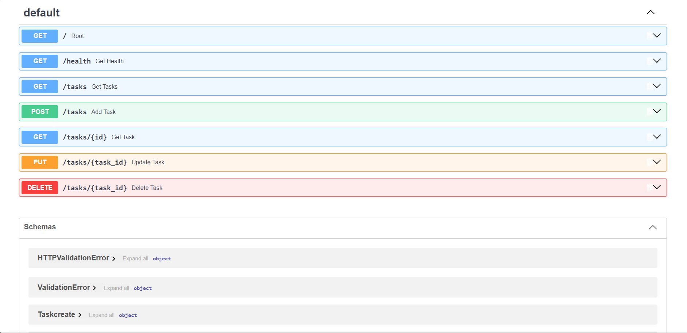

# Task API

A simple RESTful API built with **FastAPI** for managing tasks.

The application stores tasks in an **in-memory Python list**, so the data will be lost whenever the application is restarted.

## Features

- View API information
- Check application health
- Get all tasks
- Get a specific task by ID
- Create a new task
- Update an existing task
- Delete a task
- Automatic API documentation with Swagger UI

## Technologies

- Python
- FastAPI
- Pydantic
- Uvicorn

---

## Installation & Running

### 1. Install the dependencies
pip install fastapi uvicorn

### 2. Run the API

From the project directory, run: uvicorn main:app --reload

The API will be available at:

http://127.0.0.1:8000

Swagger UI is available at:

http://127.0.0.1:8000/docs

---

## API Endpoints

| Method | Endpoint | Description | Success Status |
|---|---|---|---|
| `GET` | `/` | Display API information | `200 OK` |
| `GET` | `/health` | Check API health | `200 OK` |
| `GET` | `/tasks` | Get all tasks | `200 OK` |
| `GET` | `/tasks/{id}` | Get a specific task by ID | `200 OK` |
| `POST` | `/tasks` | Create a new task | `201 Created` |
| `PUT` | `/tasks/{task_id}` | Update an existing task | `201 Created` |
| `DELETE` | `/tasks/{task_id}` | Delete a task | `204 No Content` |

---

## Example Requests

### Get all tasks

curl -i http://127.0.0.1:8000/tasks

### Get a specific task

curl -i http://127.0.0.1:8000/tasks/1

### Create a task

curl -i -X POST http://127.0.0.1:8000/tasks
-H "Content-Type: application/json"
-d "{"title":"learn FastAPI"}"

### Update a task

curl -i -X PUT http://127.0.0.1:8000/tasks/1
-H "Content-Type: application/json"
-d "{"done":true}"

### Delete a task

curl -i -X DELETE http://127.0.0.1:8000/tasks/1

---

## Swagger UI

FastAPI automatically provides interactive API documentation through Swagger UI.

Open:

http://127.0.0.1:8000/docs

### Swagger Screenshot

## Data Storage

This project currently uses an in-memory Python list as a result all tasks are removed when the FastAPI application is restarted.

---
---

## Notes

This project is intended as a simple demonstration of building a REST API with FastAPI. It uses an in-memory data store rather than a database, making it suitable for learning and testing the basic concepts of API development.